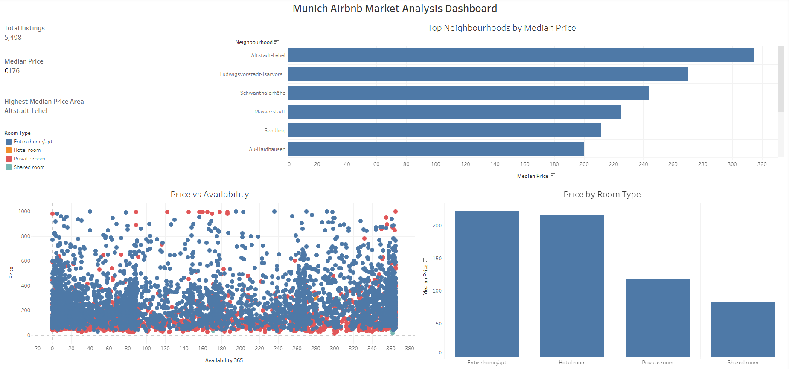
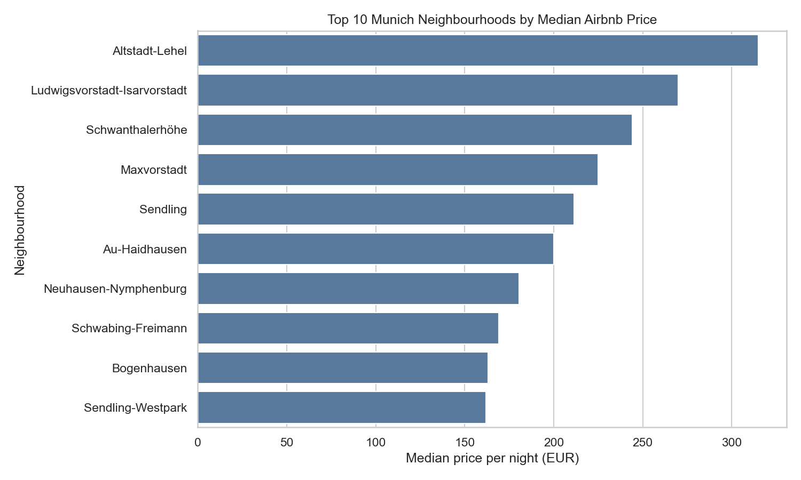
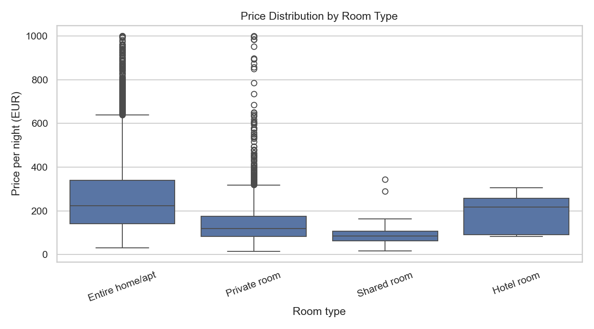
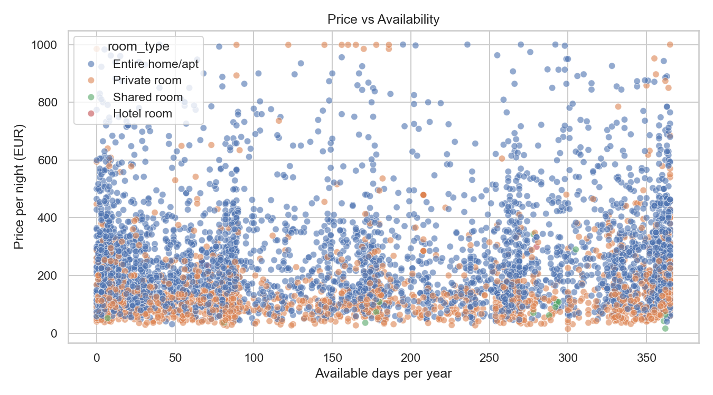
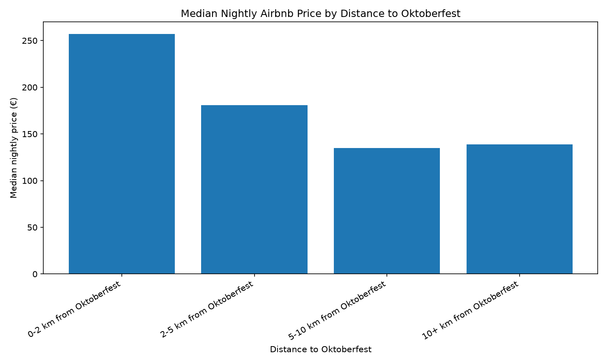
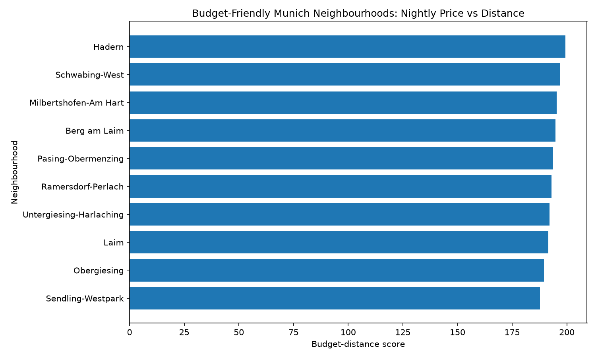

# Munich Airbnb Market Analysis

This project analyzes Airbnb listings in Munich using Python, pandas, matplotlib, seaborn, Tableau, and GitHub.

The project started as a general exploratory data analysis of Airbnb listings in Munich and was later extended with a **budget-vs-distance analysis** for visitors who may want to stay near Oktoberfest while also considering cheaper neighbourhoods outside the city center.

## Tableau Dashboard

Interactive dashboard available on Tableau Public:

[View the Tableau Dashboard](https://public.tableau.com/app/profile/van.thoi.vo/viz/MunichAirbnbMarketAnalysisDashboard/Dashboard3)



## Business Questions

This project answers the following questions:

- Which room types are most common in Munich Airbnb listings?
- How does nightly price differ between room types?
- Which Munich neighbourhoods have the highest median nightly prices?
- How does listing availability relate to price?
- How does nightly price change by distance from the Oktoberfest area?
- Which neighbourhoods may offer a better balance between price and distance?

## Dataset

The data comes from [Inside Airbnb](https://insideairbnb.com/get-the-data/), using the Munich, Bavaria, Germany dataset.

Main raw files used locally:

```text
data/raw/listings.csv
data/raw/calendar.csv.gz
```

The raw data files are not committed to GitHub because they are external dataset files. They are kept locally in the `data/raw/` folder.

## Price Interpretation

The `price` field used in this project is interpreted as the advertised daily/nightly listing price in EUR for Munich Airbnb listings.

This price should be understood as an estimated price per night. It is not monthly rent, not a full-trip cost, and not the final Airbnb checkout price including service fees, cleaning fees, taxes, or discounts.

The downloaded `calendar.csv.gz` file does not contain usable `price` or `adjusted_price` values. Therefore, this project does not claim to measure dynamic Oktoberfest-specific nightly prices.

The budget-location analysis uses listing-level nightly prices from `listings.csv` and combines them with distance to Theresienwiese to support budget-oriented neighbourhood comparison.

Important interpretation notes:

- Price unit: EUR per night
- Source of price data: `listings.csv`
- Calendar price data: unavailable in the downloaded `calendar.csv.gz`
- Not included: final booking costs, service fees, taxes, cleaning fees, discounts, or monthly rent
- Budget-distance score: a simple analytical score, not an official Airbnb recommendation

## Key Findings

From the cleaned listing dataset:

- The cleaned dataset contains 5,498 Munich Airbnb listings.
- The median nightly listing price is €176.
- The most common room type is `Entire home/apt`.
- `Entire home/apt` also has the highest median nightly price among room types.
- `Altstadt-Lehel` has the highest median nightly price among analysed neighbourhoods.

The budget-location analysis adds a visitor-focused perspective by comparing nightly price with distance to the Oktoberfest area. This helps identify neighbourhoods that may be cheaper while still being reasonably close to central Munich.

## Visualizations

### Top Neighbourhoods by Median Nightly Price



### Price by Room Type



### Price vs Availability



### Median Nightly Price by Distance to Oktoberfest



### Budget-Friendly Neighbourhood Recommendations



## Project Workflow

The project follows a typical data analyst workflow:

1. Load Airbnb listing data.
2. Clean price, availability, room type, and neighbourhood fields.
3. Remove missing or unrealistic values.
4. Create summary tables by room type and neighbourhood.
5. Generate visualizations for price and availability patterns.
6. Export Tableau-ready CSV files.
7. Build an interactive Tableau dashboard.
8. Extend the project with budget-vs-distance analysis for Oktoberfest visitors.

## Budget vs Distance Analysis

The extended analysis estimates how far each listing is from Theresienwiese, the Oktoberfest area, using listing latitude and longitude.

The analysis creates:

- Distance from each listing to Oktoberfest in kilometers
- Distance bands such as `0-2 km`, `2-5 km`, `5-10 km`, and `10+ km`
- Median nightly price by distance band
- Neighbourhood-level budget recommendations
- A simple budget-distance score

The budget-distance score is calculated as:

```text
budget_distance_score = median_price_eur_per_night + median_distance_km * 10
```

A lower score means the neighbourhood has a better balance between lower nightly price and reasonable distance from Oktoberfest.

## Generated Result Files

Main result files:

```text
results/room_type_summary.csv
results/neighbourhood_summary.csv
results/tableau_kpis.csv
results/tableau_listings.csv
results/price_by_distance_band.csv
results/budget_neighbourhood_recommendations.csv
results/tableau_budget_location_listings.csv
results/budget_location_output_dictionary.csv
```

Important output files for Tableau:

```text
results/tableau_listings.csv
results/tableau_kpis.csv
results/tableau_budget_location_listings.csv
```

The file below explains important generated columns:

```text
results/budget_location_output_dictionary.csv
```

## Tech Stack

- Python
- pandas
- NumPy
- matplotlib
- seaborn
- Tableau Public
- Git and GitHub

## Project Structure

```text
Munich_Airbnb_Analysis/
│
├── data/
│   ├── README.md
│   └── raw/
│       ├── listings.csv
│       └── calendar.csv.gz
│
├── images/
│   ├── Screenshot.png
│   ├── top_neighbourhoods_by_price.png
│   ├── price_by_room_type.png
│   ├── price_vs_availability.png
│   ├── price_by_distance_band.png
│   └── budget_neighbourhood_recommendations.png
│
├── results/
│   ├── room_type_summary.csv
│   ├── neighbourhood_summary.csv
│   ├── tableau_kpis.csv
│   ├── tableau_listings.csv
│   ├── price_by_distance_band.csv
│   ├── budget_neighbourhood_recommendations.csv
│   ├── tableau_budget_location_listings.csv
│   └── budget_location_output_dictionary.csv
│
├── scripts/
│   ├── run_analysis.py
│   └── run_budget_location_analysis.py
│
├── src/
│   └── munich_airbnb/
│       ├── __init__.py
│       ├── config.py
│       ├── load_data.py
│       ├── clean_data.py
│       ├── analyze.py
│       ├── visualize.py
│       ├── report.py
│       └── budget_location_analysis.py
│
├── Munich Airbnb Market Analysis Dashboard.twb
├── Munich Airbnb Market Analysis Dashboard.twbx
├── README.md
├── requirements.txt
└── .gitignore
```

Note: `.venv/`, raw data files, and Tableau-generated support folders should not be committed to GitHub.

## How to Run the Project

Install the required Python packages:

```bash
pip install -r requirements.txt
```

Run the main Airbnb listing analysis:

```bash
py scripts/run_analysis.py
```

Run the budget-vs-distance analysis:

```bash
py scripts/run_budget_location_analysis.py
```

The scripts generate updated CSV files in:

```text
results/
```

and updated charts in:

```text
images/
```

## Limitations

This project uses publicly available Airbnb listing data and should be interpreted as exploratory analysis, not as a complete booking-price engine.

Important limitations:

- Prices are listing-level advertised nightly prices from `listings.csv`.
- Calendar price and adjusted price values are unavailable in the downloaded `calendar.csv.gz`.
- Final booking costs such as service fees, cleaning fees, taxes, and discounts are not included.
- Distance to Oktoberfest is calculated using straight-line geographic distance, not actual public transport time.
- The budget-distance score is a simple custom analytical score and should not be interpreted as an official recommendation system.

## Future Improvements

Possible next steps:

- Add public transport travel time from each neighbourhood to Theresienwiese.
- Improve the Tableau dashboard with more filters and custom tooltips.
- Add review data to analyze demand trends over time.
- Add a simple price prediction model after the exploratory analysis.
- Build a Streamlit version for interactive budget-based neighbourhood search.