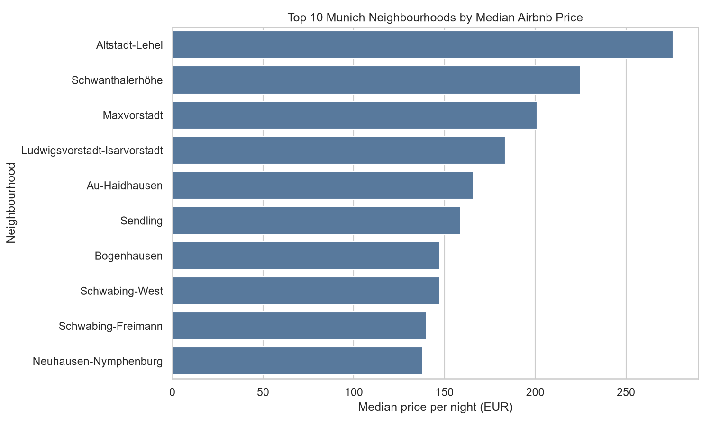
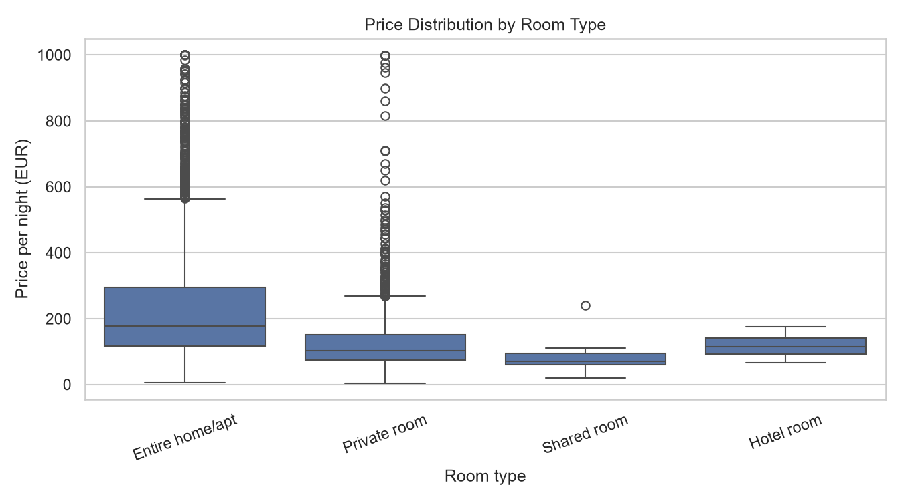
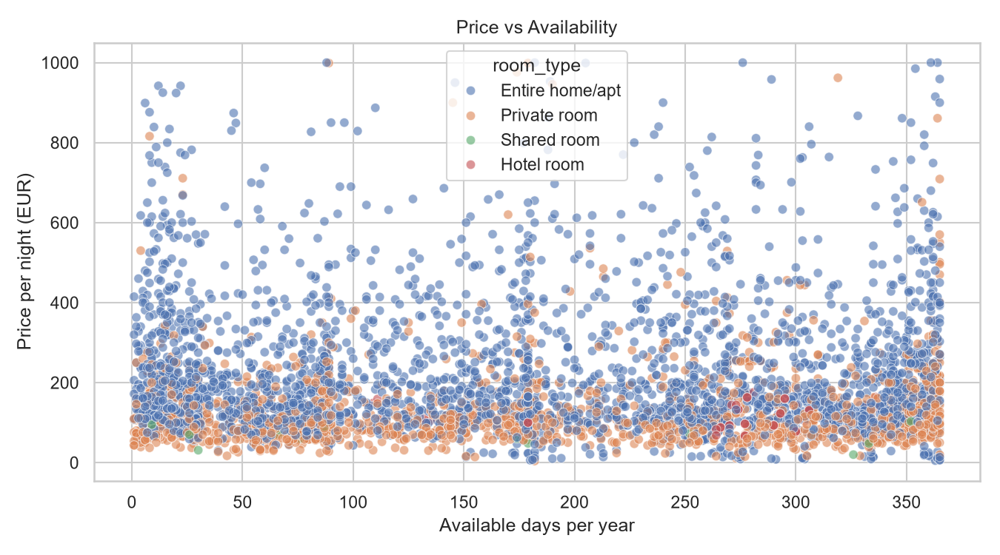
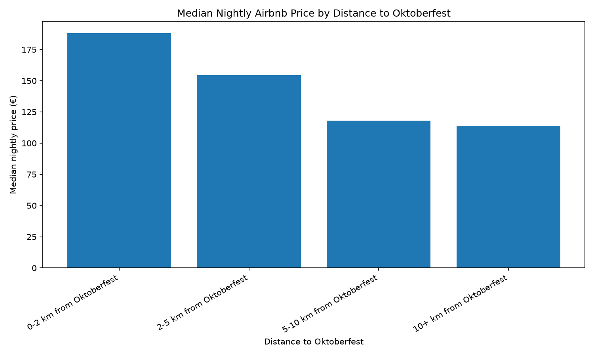
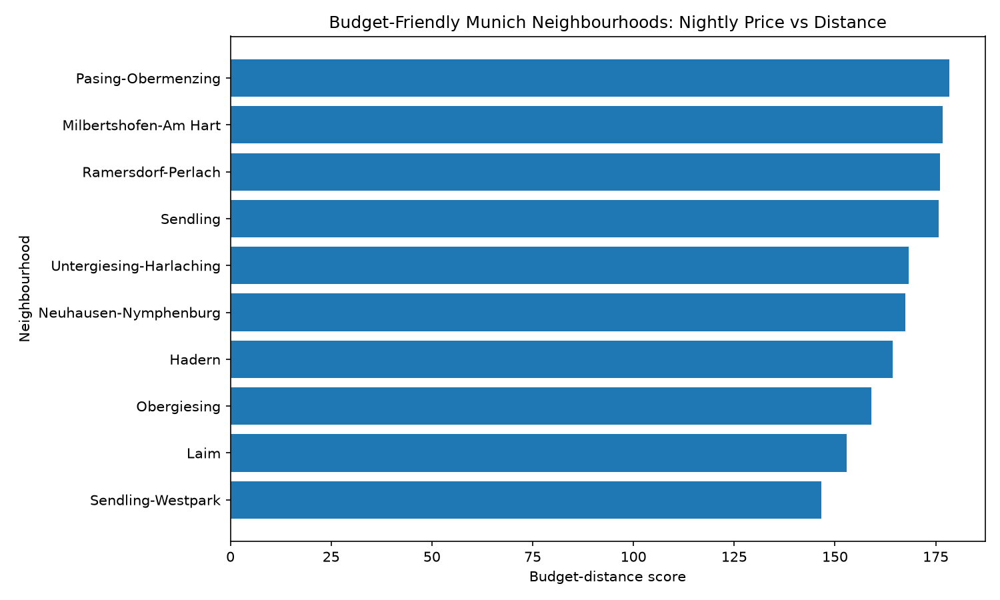

# Munich Airbnb Market Analysis

This project analyzes Airbnb listings in Munich using Python, pandas, matplotlib, seaborn, SQLite, Tableau Public, and an automated local data pipeline.

The goal is to understand nightly Airbnb prices, room-type differences, neighbourhood patterns, availability, and budget-friendly accommodation options for visitors. The project was extended with a budget-vs-distance analysis for visitors who may want to stay near Oktoberfest while also considering cheaper areas outside the city center.

The project also includes cleaned historical data storage in SQLite and local workflow automation with n8n.

> This README is generated automatically from `README_template.md` and the latest files in `results/`.

## Latest Data Refresh

- Latest dataset snapshot: `2026-06-29`
- README generated at: `2026-08-30T23:54:42`
- Total cleaned listings: `4,387`
- Median nightly listing price: `€143`
- Price unit: `EUR per night`

## Tableau Dashboard

Interactive dashboard available on Tableau Public:

[View the Tableau Dashboard](https://public.tableau.com/app/profile/van.thoi.vo/viz/MunichAirbnbMarketAnalysisDashboard/Dashboard3)

## Business Questions

This project answers the following questions:

- Which room types are most common in Munich Airbnb listings?
- How does nightly price differ between room types?
- Which Munich neighbourhoods have the highest median nightly prices?
- How does listing availability relate to price?
- How does nightly price change by distance from the Oktoberfest area?
- Which neighbourhoods may offer a better balance between nightly price and distance?
- How can cleaned Airbnb listing snapshots be stored for future trend analysis or price prediction?

## Dataset

The data comes from Inside Airbnb, using the Munich, Bavaria, Germany dataset.

Main files used locally:

- `listings.csv`
- `calendar.csv.gz`

The raw data files are stored locally in:

```text
data/raw/
```

Raw data files are not committed to GitHub because they are external dataset files. Instead, the repository documents the data source and keeps reproducible analysis code.

The raw files can be overwritten when the pipeline downloads a newer dataset snapshot.

## Price Interpretation

The `price` field used in this project is interpreted as the advertised daily/nightly listing price in EUR for Munich Airbnb listings.

This price should be understood as an estimated price per night. It is not monthly rent, not a full-trip cost, and not the final Airbnb checkout price including service fees, cleaning fees, taxes, or discounts.

The downloaded `calendar.csv.gz` file does not contain usable `price` or `adjusted_price` values. Therefore, this project does not claim to measure dynamic Oktoberfest-specific nightly prices. The budget-location analysis uses listing-level nightly prices from `listings.csv` and combines them with distance to Theresienwiese to support budget-oriented neighbourhood comparison.

Important interpretation notes:

- Price unit: EUR per night
- Source of price data: `listings.csv`
- Calendar price data: unavailable in the downloaded `calendar.csv.gz`
- Not included: final booking costs, service fees, taxes, cleaning fees, discounts, or monthly rent
- Budget-distance score: a simple analytical score created for comparison, not an official Airbnb recommendation

## Key Findings

From the latest cleaned listing dataset:

- The cleaned dataset contains `4,387` Munich Airbnb listings.
- The median nightly listing price is `€143`.
- The most common room type is `Entire home/apt`.
- The room type with the highest median nightly price is `Entire home/apt`.
- The neighbourhood with the highest median nightly price is `Altstadt-Lehel`.

The budget-location analysis adds a visitor-focused perspective by comparing nightly price with distance to the Oktoberfest area.

- Best budget-distance neighbourhood: `Sendling-Westpark`
- Best budget-distance price: `€119` per night
- Best budget-distance median distance: `2.8 km`
- Cheapest neighbourhood with enough listings: `Aubing-Lochhausen-Langwied`
- Cheapest neighbourhood median price: `€110` per night
- Cheapest neighbourhood median distance: `10.4 km`

## Price by Distance to Oktoberfest

| Distance band | Listings | Median nightly price (€) | Median distance (km) |
| --- | --- | --- | --- |
| 0-2 km from Oktoberfest | 955 | 188 | 1.1 |
| 2-5 km from Oktoberfest | 1,814 | 154 | 3.2 |
| 5-10 km from Oktoberfest | 1,371 | 118 | 6.7 |
| 10+ km from Oktoberfest | 247 | 114 | 10.5 |

## Budget-Friendly Neighbourhood Recommendations

| Neighbourhood | Listings | Median nightly price (€) | Median distance (km) | Budget-distance score |
| --- | --- | --- | --- | --- |
| Sendling-Westpark | 158 | 119 | 2.8 | 146.5 |
| Laim | 134 | 122 | 3.1 | 152.8 |
| Obergiesing | 146 | 124 | 3.5 | 159.1 |
| Hadern | 43 | 115 | 4.9 | 164.4 |
| Neuhausen-Nymphenburg | 241 | 138 | 2.9 | 167.4 |
| Untergiesing-Harlaching | 131 | 136 | 3.2 | 168.3 |
| Sendling | 134 | 159 | 1.7 | 175.7 |
| Ramersdorf-Perlach | 202 | 113 | 6.3 | 176.0 |
| Milbertshofen-Am Hart | 141 | 116 | 6.1 | 176.7 |
| Pasing-Obermenzing | 145 | 111 | 6.7 | 178.3 |

## Visualizations

### Top Neighbourhoods by Median Nightly Price



### Price by Room Type



### Price vs Availability



### Median Nightly Price by Distance to Oktoberfest



### Budget-Friendly Neighbourhood Recommendations



## Project Workflow

The project follows a reproducible data analyst workflow:

1. Download or refresh the latest Munich Airbnb source data.
2. Store raw downloaded files locally in `data/raw/`.
3. Load Airbnb listing data.
4. Clean price, availability, room type, neighbourhood, review, and location fields.
5. Remove missing or unrealistic values.
6. Add analysis-ready features such as distance to Oktoberfest.
7. Store the cleaned row-level listing dataset in SQLite.
8. Keep historical cleaned snapshots using `snapshot_date` and `ingested_at`.
9. Create summary tables by room type, neighbourhood, and distance band.
10. Generate visualizations for price, availability, and budget-location patterns.
11. Export Tableau-ready CSV files.
12. Regenerate the README automatically from latest pipeline outputs.
13. Optionally trigger the pipeline using n8n.

## SQLite Cleaned Data Storage

This project stores the cleaned, analysis-ready Airbnb listing dataset in a local SQLite database.

The raw downloaded files in `data/raw/` are treated as external source files and can be overwritten when the pipeline refreshes the data.

The SQLite database is generated at:

```text
data/processed/munich_airbnb.sqlite
```

The main database tables are:

```text
cleaned_listings_latest
cleaned_listings_history
pipeline_runs
```

### Table Meanings

`cleaned_listings_latest` contains the most recent cleaned listing dataset.

`cleaned_listings_history` keeps historical cleaned listing snapshots. Each row includes metadata columns such as:

- `snapshot_date`
- `ingested_at`
- `source_name`

This makes it possible to compare cleaned Airbnb listing data across different dataset refreshes.

`pipeline_runs` stores metadata about pipeline executions, such as the snapshot date, ingestion time, source file name, and row count.

### Why This Matters

The SQLite database creates a reusable analytical storage layer.

It can support future analysis such as:

- comparing median prices across different dataset snapshots
- tracking neighbourhood price changes over time
- preparing a future price prediction dataset
- building features based on month, year, location, room type, availability, and review activity

Important: this does not currently support true dynamic Oktoberfest 2026 price forecasting, because the downloaded `calendar.csv.gz` file does not contain usable `price` or `adjusted_price` values.

## Automated Pipeline

The project includes an automated local pipeline.

Run the full pipeline with existing local raw data:

```bash
py scripts/run_pipeline.py --skip-download
```

Run the full pipeline and download the latest Inside Airbnb Munich data:

```bash
py scripts/run_pipeline.py --force-download
```

The pipeline updates:

```text
data/raw/
data/processed/munich_airbnb.sqlite
results/
images/
README.md
```

## Automation with n8n

This project includes a local n8n workflow for automating the Munich Airbnb data pipeline.

The n8n workflow uses:

- Manual Trigger for testing
- Schedule Trigger for weekly automation
- Execute Command to run the local pipeline wrapper

The command executed by n8n is:

```powershell
cmd /c call "D:\PycharmProjects\Munich_Airbnb_Analysis\scripts\run_pipeline_n8n.bat" --force-download
```

The workflow runs the full Python pipeline, which:

- downloads or refreshes the latest available Inside Airbnb data
- overwrites local raw source files
- cleans and transforms the listing dataset
- stores cleaned listing snapshots in SQLite
- runs the main exploratory data analysis
- runs the budget-vs-distance analysis
- updates result CSV files
- updates chart images
- regenerates this README from `README_template.md`

The exported n8n workflow is stored in:

```text
workflows/munich_airbnb_n8n_workflow.json
```

Detailed setup notes are available in:

```text
docs/n8n_automation.md
```

Important: this is a local automation setup. The scheduled workflow only runs when the laptop is turned on, n8n is running, and the workflow is active.

## Budget vs Distance Analysis

The extended analysis estimates how far each listing is from Theresienwiese, the Oktoberfest area, using listing latitude and longitude.

The analysis creates:

- Distance from each listing to Oktoberfest in kilometers
- Distance bands such as `0-2 km`, `2-5 km`, `5-10 km`, and `10+ km`
- Median nightly price by distance band
- Neighbourhood-level budget recommendations
- A simple budget-distance score

The budget-distance score is calculated as:

```text
budget_distance_score = median_price_eur_per_night + median_distance_km * 10
```

A lower score means the neighbourhood has a better balance between lower nightly price and reasonable distance from Oktoberfest.

## Generated Result Files

The files in `results/` are analysis outputs generated from the cleaned data. They are not the main cleaned database. The main cleaned dataset is stored in SQLite.

Main result files:

```text
results/room_type_summary.csv
results/neighbourhood_summary.csv
results/tableau_kpis.csv
results/tableau_listings.csv
results/price_by_distance_band.csv
results/budget_neighbourhood_recommendations.csv
results/tableau_budget_location_listings.csv
results/budget_location_output_dictionary.csv
results/download_manifest.json
```

Important output files for Tableau or Power BI:

```text
results/tableau_listings.csv
results/tableau_kpis.csv
results/tableau_budget_location_listings.csv
```

The file below explains important generated budget-location columns:

```text
results/budget_location_output_dictionary.csv
```

## Tech Stack

- Python
- pandas
- NumPy
- matplotlib
- seaborn
- SQLite
- Tableau Public
- n8n
- Node.js / npm
- Git and GitHub
- Automated local data pipeline

## Project Structure

```text
Munich_Airbnb_Analysis/
│
├── data/
│   ├── README.md
│   ├── raw/
│   │   ├── listings.csv
│   │   └── calendar.csv.gz
│   └── processed/
│       └── munich_airbnb.sqlite
│
├── docs/
│   └── n8n_automation.md
│
├── images/
│   ├── top_neighbourhoods_by_price.png
│   ├── price_by_room_type.png
│   ├── price_vs_availability.png
│   ├── price_by_distance_band.png
│   └── budget_neighbourhood_recommendations.png
│
├── results/
│   ├── room_type_summary.csv
│   ├── neighbourhood_summary.csv
│   ├── tableau_kpis.csv
│   ├── tableau_listings.csv
│   ├── price_by_distance_band.csv
│   ├── budget_neighbourhood_recommendations.csv
│   ├── tableau_budget_location_listings.csv
│   ├── budget_location_output_dictionary.csv
│   └── download_manifest.json
│
├── scripts/
│   ├── run_analysis.py
│   ├── run_budget_location_analysis.py
│   ├── run_pipeline.py
│   ├── export_to_sqlite.py
│   ├── run_pipeline_n8n.bat
│   └── start_n8n.bat
│
├── src/
│   └── munich_airbnb/
│       ├── __init__.py
│       ├── config.py
│       ├── load_data.py
│       ├── clean_data.py
│       ├── analyze.py
│       ├── visualize.py
│       ├── report.py
│       ├── budget_location_analysis.py
│       ├── database.py
│       ├── download_data.py
│       ├── pipeline.py
│       └── readme_generator.py
│
├── workflows/
│   └── munich_airbnb_n8n_workflow.json
│
├── README.md
├── README_template.md
├── requirements.txt
├── package.json
├── package-lock.json
└── .gitignore
```

Note: the local `.venv/` folder, Tableau local support folders, `node_modules/`, local n8n runtime files, SQLite database files, and raw data files should not be committed to GitHub.

## How to Run the Project

Install the required Python packages:

```bash
pip install -r requirements.txt
```

Install local Node.js / n8n dependencies:

```bash
npm install
```

Run the main Airbnb listing analysis:

```bash
py scripts/run_analysis.py
```

Run the budget-vs-distance analysis:

```bash
py scripts/run_budget_location_analysis.py
```

Run the full automated pipeline with existing local raw data:

```bash
py scripts/run_pipeline.py --skip-download
```

Run the full automated pipeline and refresh the raw data:

```bash
py scripts/run_pipeline.py --force-download
```

Start local n8n:

```bash
scripts/start_n8n.bat
```

Then open:

```text
http://localhost:5678
```

The scripts generate updated CSV files in:

```text
results/
```

updated charts in:

```text
images/
```

and the cleaned SQLite database in:

```text
data/processed/
```

## Limitations

This project uses publicly available Airbnb listing data and should be interpreted as exploratory analysis, not as a complete booking-price engine.

Important limitations:

- Prices are listing-level advertised nightly prices from `listings.csv`.
- Calendar price and adjusted price values are unavailable in the downloaded `calendar.csv.gz`.
- SQLite historical analysis becomes more useful only after multiple dataset snapshots have been collected over time.
- The Tableau Public dashboard may need to be refreshed or republished separately depending on the dashboard data connection.
- Local n8n automation only runs when the laptop is turned on, n8n is running, and the workflow is active.

## Future Improvements

Possible next steps:

- Collect multiple cleaned SQLite snapshots over time for trend analysis.
- Build a simple price prediction model using the cleaned historical SQLite dataset.
- Add public transport travel time from each neighbourhood to Theresienwiese.
- Improve the Tableau dashboard with more filters and custom tooltips.
- Add review data to analyze demand trends over time.
- Deploy n8n on an always-on server or cloud instance for true scheduled automation.
- Build a Streamlit version for interactive budget-based neighbourhood search.